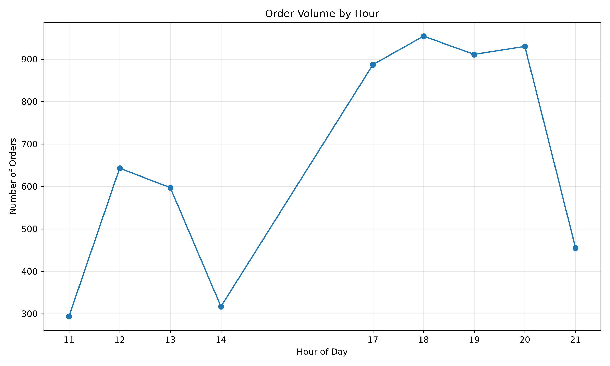
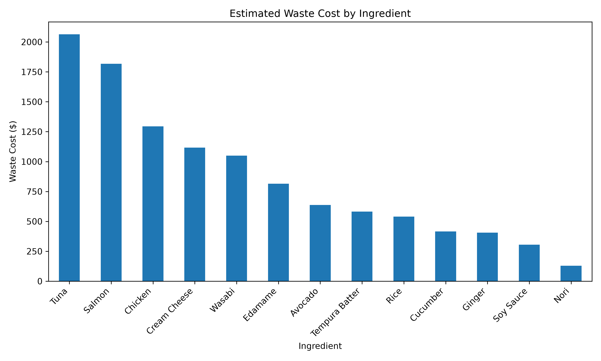
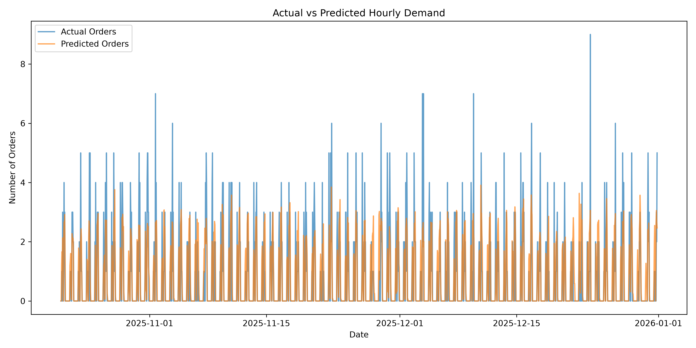
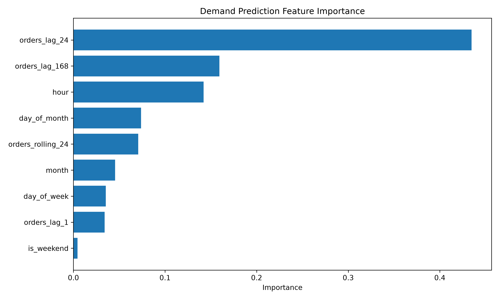

# Sushi Restaurant Data Investigation & Operations Analytics

An end-to-end data investigation of restaurant demand, revenue, inventory waste, staffing efficiency, and demand forecasting using multi-source operational data.

**Tech stack:** Python · pandas · NumPy · Polars · scikit-learn · Matplotlib

## Project Overview

This project explores how transactional, menu, inventory, and staffing data can be combined to answer operational questions for a sushi restaurant.

The project was designed as a data investigation rather than a simple visualization exercise. The workflow includes:

- Data quality inspection and validation
- Cleaning and normalization of inconsistent records
- Multi-source data integration
- Feature engineering
- Demand and revenue analysis
- Inventory waste analysis
- Staffing efficiency analysis
- Time-series demand forecasting
- Model evaluation against a baseline
- Reimplementation of an analysis in Polars

The dataset is synthetic and intentionally contains data-quality issues so that the project can demonstrate realistic data-cleaning and validation workflows.

---

## Key Results

- **5,988** cleaned order records analyzed across one full year (2025)
- **$122,870.50** in total recorded revenue
- **Spicy Tuna Roll** was the highest-volume menu item with 1,504 units sold, and also led in revenue ($16,544) and estimated profit
- **6 PM** was the busiest operating hour
- **Dinner** accounted for approximately 69% of recorded orders
- **Dine-in** made up 61% of orders, takeout 26%, and delivery 13%, with nearly identical average revenue per order line (~$20.50) across all three
- **$11,172** in estimated inventory waste cost; **Tuna and Salmon** alone accounted for ~35% of it
- Waste *rates* were nearly uniform (~6–7%) across all 13 ingredients, so waste cost was driven by ingredient price rather than by any one ingredient being mishandled
- **Servers** accounted for ~58% of all labor hours
- Random Forest reduced **MAE by 25.3%** (1.18 → 0.88 orders per hour) relative to the previous-day same-hour baseline
- Random Forest reduced **RMSE by 28.3%** (1.74 → 1.25 orders per hour) relative to the same baseline

---

## Figures

### Orders by Hour


### Inventory Waste Cost by Ingredient


### Actual vs. Predicted Hourly Demand


### Demand Model Feature Importance


Additional figures (menu demand, revenue by day, revenue by order type, and revenue per labor hour) are available in [`outputs/figures/`](outputs/figures/).

---

## How to Run

```bash
git clone https://github.com/xSou1d/Sushi-Data-Analytics.git
cd Sushi-Data-Analytics
pip install -r requirements.txt
mkdir data/processed
```

Run the scripts in order from the repository root:

```bash
python src/01_load_and_inspect.py
python src/02_clean_data.py
python src/03_merge_and_engineer.py
python src/04_demand_analysis.py
python src/05_visualize.py
python src/06_operations_analysis.py
python src/07_operations_visualize.py
python src/08_demand_prediction.py
python src/09_prediction_visualize.py
python src/10_polars_analysis.py
```

Each script reads the output of the previous step from `data/processed/`, and figures are saved to `outputs/figures/`.

---

## Project Structure

```text
Sushi-Data-Analytics/
├── data/
│   ├── raw/                  # Original synthetic CSVs (never modified)
│   └── processed/            # Generated by the pipeline (git-ignored)
├── outputs/
│   └── figures/              # Saved charts
├── src/
│   ├── 01_load_and_inspect.py
│   ├── 02_clean_data.py
│   ├── 03_merge_and_engineer.py
│   ├── 04_demand_analysis.py
│   ├── 05_visualize.py
│   ├── 06_operations_analysis.py
│   ├── 07_operations_visualize.py
│   ├── 08_demand_prediction.py
│   ├── 09_prediction_visualize.py
│   └── 10_polars_analysis.py
├── requirements.txt
└── README.md
```

---

## Questions Investigated

The analysis focuses on several practical questions:

1. Which menu items generate the most demand, revenue, and estimated profit?
2. When are the restaurant's busiest operating periods?
3. How does demand differ between dine-in, takeout, and delivery?
4. Which ingredients contribute most to inventory waste?
5. How efficiently is labor being used relative to revenue?
6. Can historical demand patterns improve short-term demand predictions?
7. Can the same analysis be reproduced using Polars?

---

## Dataset

The project uses four related datasets.

### `orders.csv`

Restaurant transaction records.

| Column | Description |
|---|---|
| `order_id` | Unique order identifier |
| `timestamp` | Date and time of the order |
| `table_id` | Restaurant table identifier |
| `menu_item` | Menu item ordered |
| `quantity` | Quantity ordered |
| `server` | Employee associated with the order |
| `order_type` | Dine-in, takeout, or delivery |
| `line_revenue` | Revenue generated by the order |

### `menu.csv`

Menu and item-level cost information.

| Column | Description |
|---|---|
| `menu_item` | Menu item name |
| `category` | Menu category |
| `price` | Menu price |
| `ingredient_cost` | Estimated ingredient cost per item |
| `prep_time_min` | Estimated preparation time |

### `inventory.csv`

Daily ingredient usage and waste.

| Column | Description |
|---|---|
| `date` | Inventory date |
| `ingredient` | Ingredient name |
| `units_received` | Units received |
| `units_used` | Units used |
| `units_wasted` | Units wasted |
| `unit_cost` | Cost per unit |

### `staffing.csv`

Daily employee staffing information.

| Column | Description |
|---|---|
| `date` | Staffing date |
| `employee` | Employee identifier |
| `role` | Employee role |
| `hours_worked` | Hours worked |

---

## Data Quality Investigation

The raw data intentionally contains several quality problems, including:

- Missing values
- Duplicate transaction records
- Inconsistent menu-item capitalization
- Non-positive order quantities
- Negative inventory usage values
- Missing staffing hours

Rather than manually modifying the source CSV files, the project identifies and handles these issues programmatically.

### Cleaning Decisions

- Exact duplicate order records were removed.
- Missing server values were labeled `"Unknown"`.
- Missing inventory waste values were treated as zero based on the assumption that an unrecorded waste value represented no recorded waste.
- Missing staffing hours were replaced using the median.
- Orders with non-positive quantities were removed.
- Inventory records with negative usage were removed.
- Menu-item names were normalized before joining datasets.

After cleaning:

- **5,988 order records** remained.
- **4,737 inventory records** remained.
- **3,650 staffing records** remained.
- All order records successfully matched to menu information.
- Every order's `line_revenue` matched `price × quantity`, so no revenue inconsistencies were found.

These assumptions are documented because cleaning decisions can affect downstream analysis.

---

## Feature Engineering

The project derives additional variables from the raw data, including:

- Estimated ingredient cost
- Estimated gross profit
- Profit margin
- Date
- Hour
- Day of week
- Day number
- Weekend indicator
- Meal period

Estimated gross profit is calculated as:

```text
estimated gross profit =
line revenue - estimated ingredient cost
```

---

## Demand Forecasting

The forecasting task predicts the **number of orders per hour** during operating hours (11 AM–9 PM).

### Features

- **Calendar features:** hour, day of week, day of month, month, weekend indicator
- **Lag features:** orders 1 hour earlier, 24 hours earlier (same hour yesterday), and 168 hours earlier (same hour last week)
- **Rolling feature:** mean orders over the previous 24 hours

### Evaluation Approach

- **Chronological 80/20 split** to avoid training on future data
  - Training: Jan 8 – Oct 21, 2025 (3,149 hourly observations)
  - Testing: Oct 21 – Dec 31, 2025 (788 hourly observations)
- **Baseline:** predict the same number of orders as the same hour on the previous day
- **Model:** Random Forest Regressor (200 trees, max depth 12)

### Results

| Model | MAE (orders/hour) | RMSE (orders/hour) |
|---|---|---|
| Previous-day same-hour baseline | 1.18 | 1.74 |
| Random Forest | **0.88** | **1.25** |
| Improvement | 25.3% | 28.3% |

**Hour of day** was by far the most important feature (~49% of total importance), which is consistent with the strong lunch and dinner peaks in the data.

---

## Polars Reimplementation

The menu-level analysis (units sold, revenue, and estimated profit per item) was rebuilt in Polars to compare its expression-based API with pandas. The Polars version produced identical results, including Spicy Tuna Roll's 1,504 units, $16,544 in revenue, and $11,881.60 in estimated profit.

---

## Limitations

- **Synthetic data:** The data is generated, so the patterns reflect how it was built and not the behavior of a real restaurant.
- **Labor efficiency is unrealistic:** Average revenue per labor hour comes out to about **$4.77** (~$337 in daily revenue against ~71 daily staff hours). This is a quirk of the synthetic data and not a meaningful business finding, so labor results are better read as relative comparisons between days and roles than as absolute numbers.
- **Little weekly variation:** Revenue is nearly flat across days of the week, and weekend orders (28.5%) match the share expected from the number of weekend days alone (2/7 ≈ 28.6%). Real restaurants usually show stronger weekend effects.
- **Gross profit is approximate:** Profit only subtracts ingredient cost and does not account for labor, rent, or other overhead.
- **Single test window:** The model was evaluated on one chronological split. Rolling or walk-forward validation would give a more reliable estimate of performance.

---

## Purpose

Before studying data science, I worked as a sushi chef and team lead, where questions like "how much fish should we prep for Friday?" or "are we overstaffed on weekday lunches?" were answered mostly by instinct. This project was built to explore how those same operational questions could be answered with data instead.

My goals were to:

- Practice a full analysis workflow, from messy raw data to validated, documented conclusions
- Make and justify cleaning decisions rather than hiding them
- Evaluate a predictive model honestly against a simple baseline
- Strengthen my skills in pandas, Polars, and scikit-learn as part of my B.S. in Data Science at the University of Florida

The emphasis throughout is on statistical reasoning and transparent assumptions, not just producing charts.